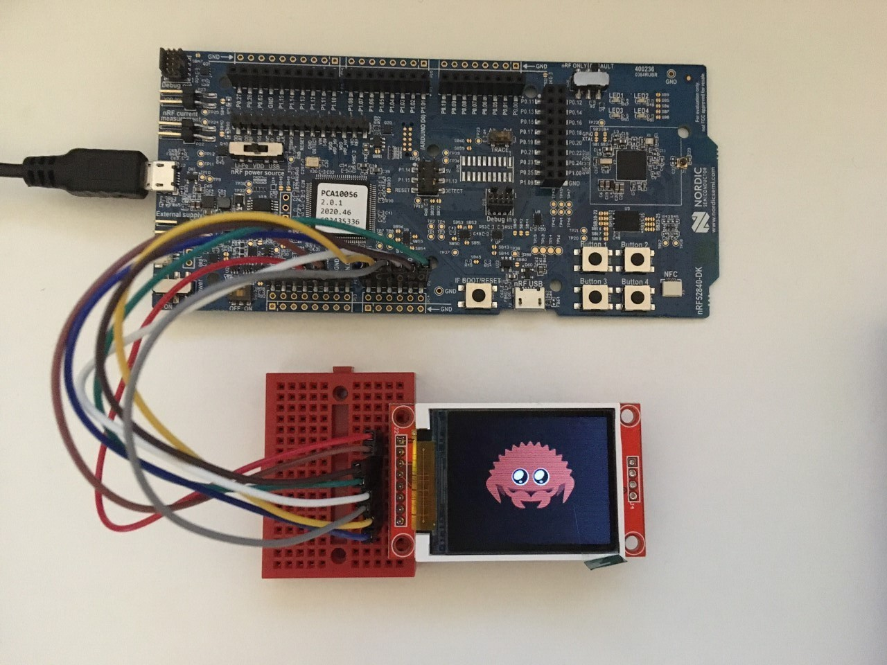

# ST7735 LCD example using nrf52840

## Run example

`$ cargo rb ferris`

If you want to run your own image, find a `.png` and convert with ImageMagick:

`$ convert <your_image>.png -type truecolor -define bmp:subtype=RGB565 -depth 16 -strip -resize 86x64 <new_bmp>.bmp`

<p align="center">

</p>

Then replace your image in the code:

```rust
let raw_image: Bmp<Rgb565> =
        Bmp::from_slice(include_bytes!("../../assets/<new_bmp>.bmp")).unwrap();
```
## Configuration pins for nRF52840 DK 

The pin configuration is currently made for <? the Boss>. If you want to try that on nRF52840 DK, use the following configuration.

### Code to change:
```rust=
let spim = spim::Spim::new_txonly(p.SPI3, irq, <sck>, p.P0_28<mosi>
let cs_pin = Output::new(<cs>, Level::Low, OutputDrive::Standard);
// ...
let rst = Output::new(<rst>, Level::High, OutputDrive::Standard);

let dc = Output::new(<dc>, Level::High, OutputDrive::Standard);
//...
let mut backlight = Output::new(<led>, Level::High, OutputDrive::Standard);
```

| In code   | Why                                     | Name on screen | Pin on nRF52840 DK |
| --------- | --------------------------------------- | -------------- | ------------------ |
| sck       | Clock                                   | SCK            | `P0_04`            |
| mosi      | Serial DAta                             | SDA            | `P0_28`            |
| cs        | Chip Select (choosing peripheral)       | CS             | `P0_30`            |
| dc        | data/command selection                  | A0             | `P0_29`            |
| backlight | Background light  (try to change it 😊) | LED            | `P0_03`            |
| x         | Ground                                  | GND            | `GND`                |
| x         | Power                                   | VCC            | `5V`                 |

